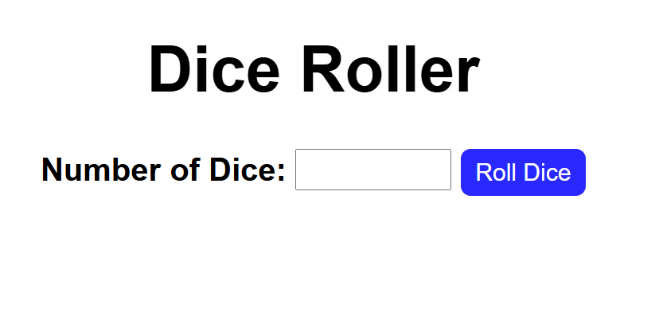
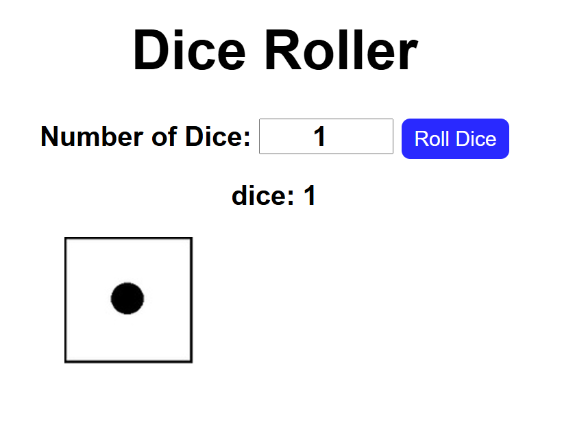
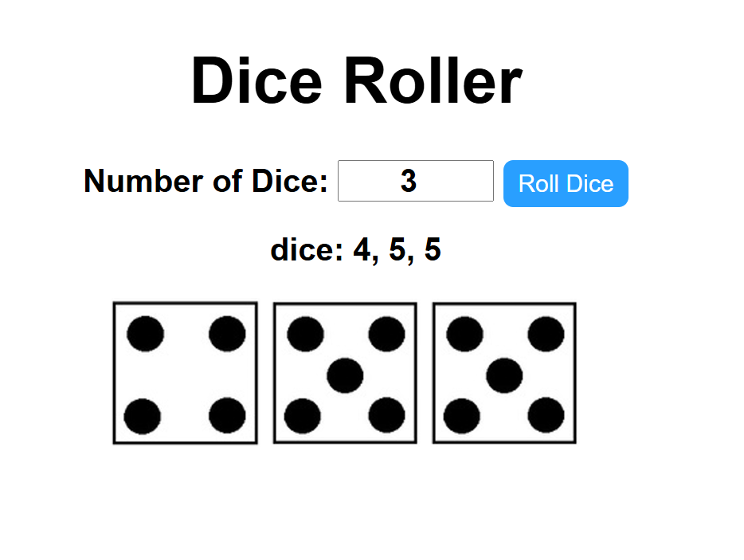

# Dice Roller 

This is a project I made to further learning and practice my html, css, and javascript skills.
I wanted to create a website that allowed users to roll a dice. I also wanted to know how I could
use the Math.random in a projects and this gave me the idea.

To use it you first need to add a number of dice you wish to roll.

Once you select the number of dice you wish to roll it will output the number and the image of the dice.

Another example below.
